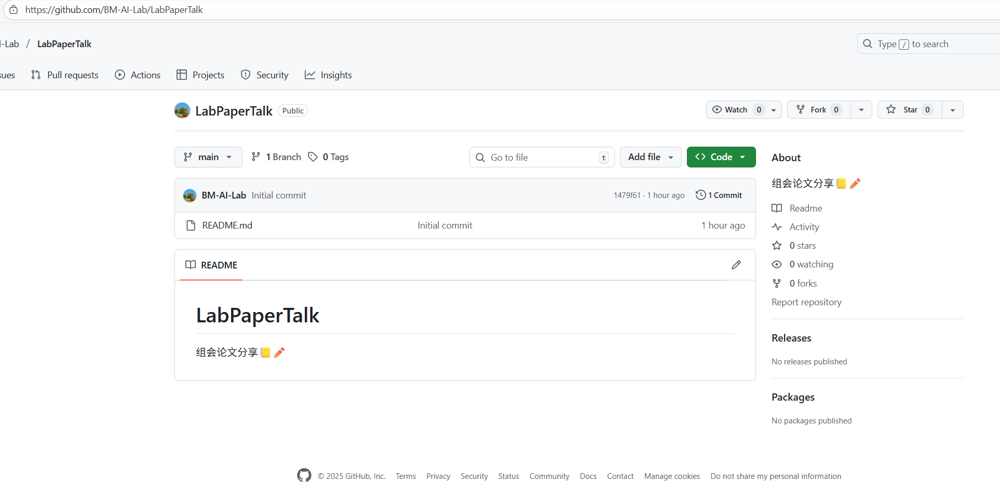
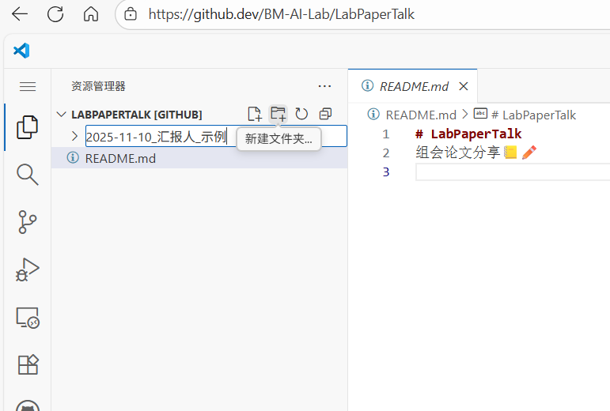
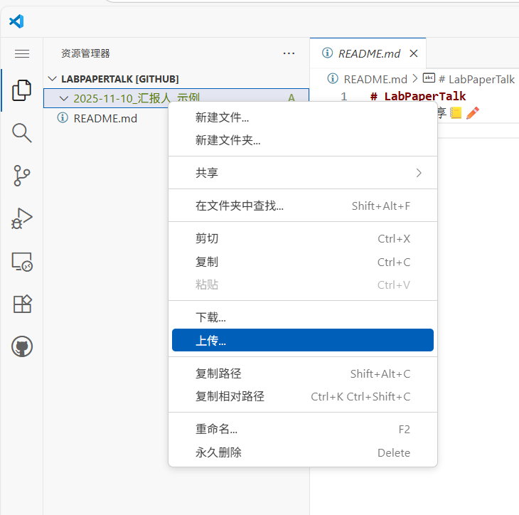
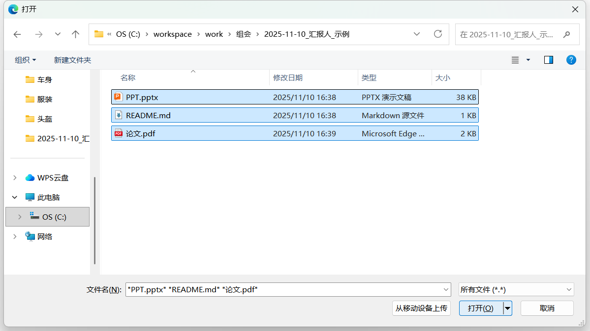
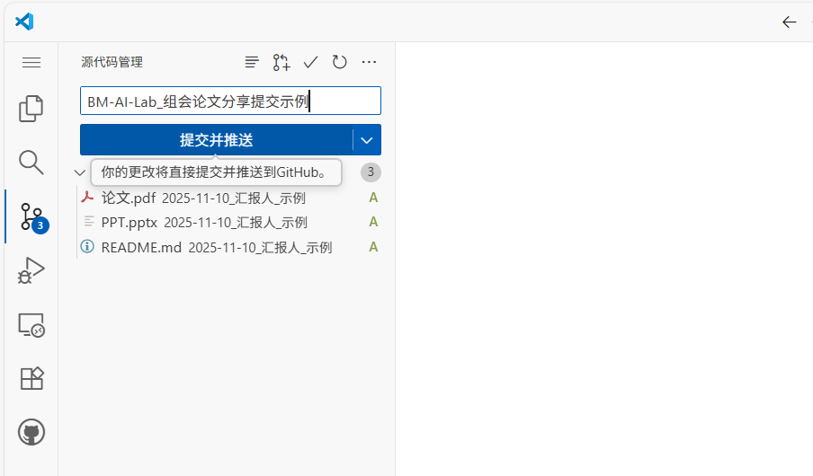
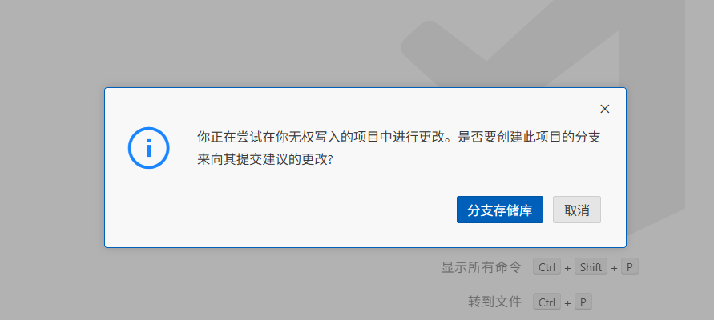
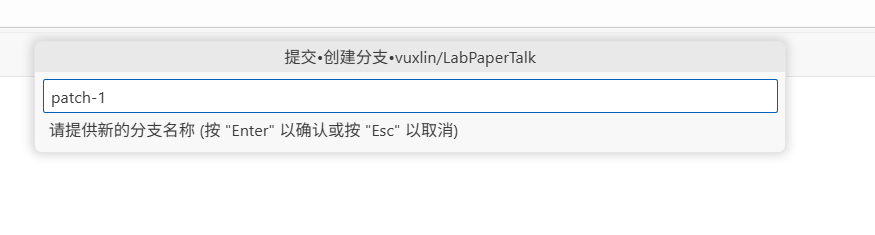
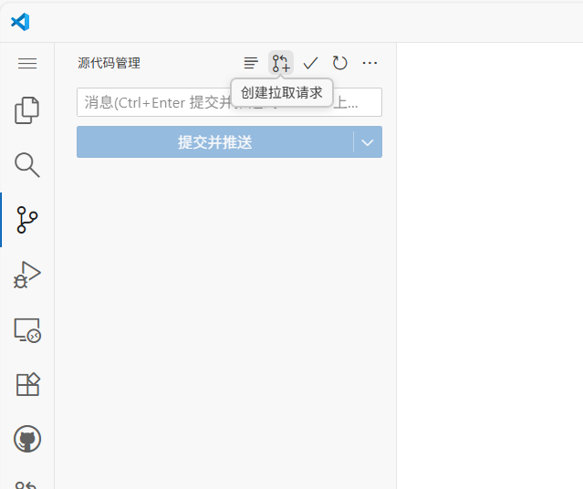
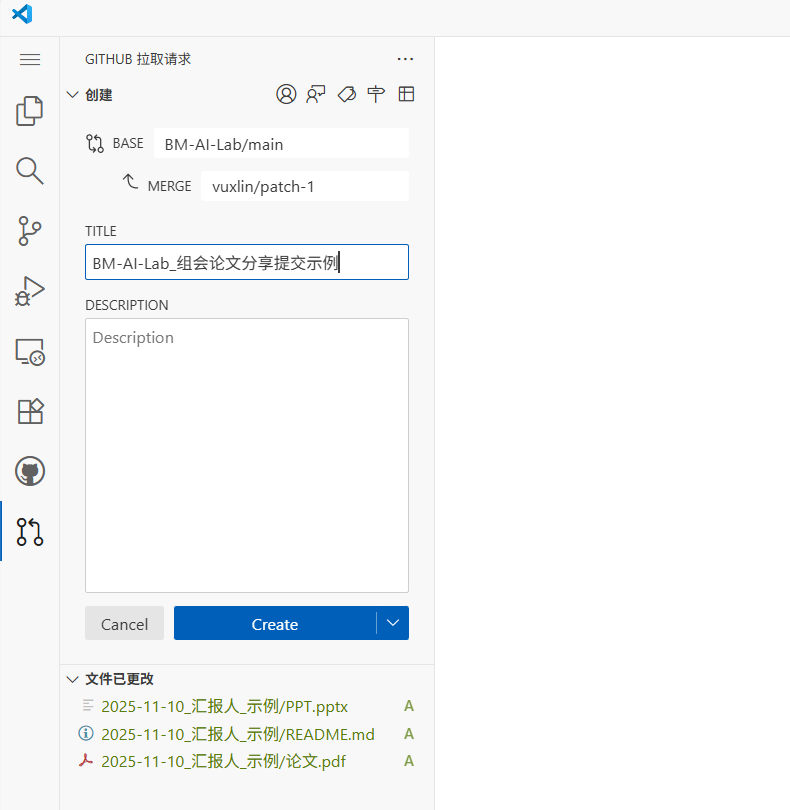

# LabPaperTalk
组会论文分享📒✏️

## 🚀 如何添加你的汇报

### 1. 访问仓库首页
   

### 2. 开启云端编辑器  
   按 `.` 进入 github.dev，打开 VS Code 网页版，并**登录自己GitHub账户**  
   **或者**  
   点击绿色 `Code` → 选择 `Codespaces` → 点击 `Create codespace on main`  
   等待约 30 秒，VS Code 网页版自动打开  

### 3. 新建个人汇报文件夹  
   在左侧资源管理器空白处右键 → `New Folder`  
   输入文件夹名，格式为：  
   `YYYY-MM-DD_汇报人姓名_论文标题`  
   例如：`2025-11-10_汇报人_示例`  
   

### 4. 拖入文件  
   将 ppt、paper等文件**上传**或**直接拖进**刚建好的文件夹  
   单文件不超过 100 MB  
   **强制包含README.md文件**，填写模板`2025-11-10_汇报人_示例/README.md`
   
   

### 5. 提交并生成新分支  
   左侧打开 `Source Control` 面板 → 输入**提交信息**    
     
   点击 `Commit & Push`  
   创建新分支  
   
     

### 6. 发起 Pull Request  
   左侧打开 `Source Control` 面板 → 点击**创建拉取请求**  
     
   点击`Create`按钮，发起`Pull Request`  
     

## 添加完成
---